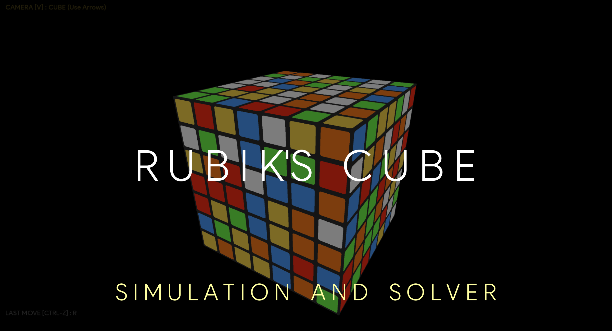
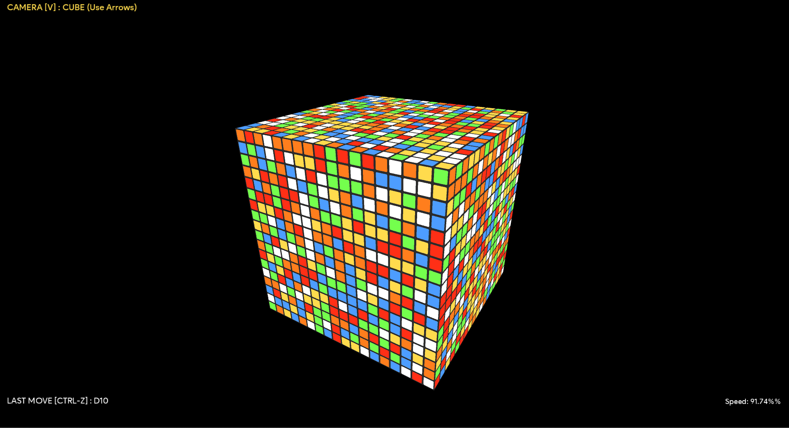

# Rubik's Cube Simulation and Solver-AI

#### This is a 3D generic NxNxN Rubik's cube simulation and solver program. It supports any N-dimension cube, with graphical and Command-Line interface controls

#### [View Demo on YouTube](https://youtu.be/F2-AvgGIDos)

###### See also

[Fourier Series Simulation](https://github.com/ChauhanRohan-RC/Fourier-Series.git)  
[RSA Encryptor](https://github.com/ChauhanRohan-RC/RSA-Encryptor.git)  
[Online Multiplayer Ping-Pong AI](https://github.com/ChauhanRohan-RC/Ping-Pong-AI.git)

## Algorithm

* Uses a 2-phase A* algorithm with manhattan cost function, based
  on [Kociemba Algorithm](http://kociemba.org/math/imptwophase.htm)
* **Can solve a 3x3 cube under 20 moves in less than 1 second**
* The preprocessing phase includes
    * Error checks for facelets, edges, corners, edge flips, corner twists and parity
    * Normalization of odd dimensional cubes against flipping transformations that changes center cubies orientation
    * Conversion of cubie-facelet representation to normalized face representation with standard facelet codes
* The search phase includes
    * Align corner pieces to match parity
    * Solve corners
    * Solve edges
    * Align corners and edges together
    * Finally, solve faces to match facelets

# Features

* Create and interact with any NxNxN cube in 3D space
* Both graphical and Command Line interface controls

### Move Features

* Inner layer moves
* Clockwise, anticlockwise and 180° rotation moves
* Reverse and undo applied moves
* Apply Multiple moves at once, including outer and inner layer moves
* Scramble the cube with given number of random moves

### Graphical Features

* Free and Clamped Camera modes in a 3D space
* Translate, Scale, Yaw, Pitch and Roll the cube with animations
* idle state levitation: cube will "**_breath_**" when idle
* stickers with 3D lighting effects

### Animation Features

* Finish or Cancel pending animations
* Control animation speed (Increase / Decrease / Set Percentage from console)
* Set move animation interpolator. Available Interpolators are

| Key        | Interpolator                       | Description                                                                                                         |
|------------|------------------------------------|---------------------------------------------------------------------------------------------------------------------|
| default    | Default                            | Uses Default Interpolator                                                                                           |
| linear     | Linear Interpolator                | Interpolates linearly between start and end states                                                                  |
| bounce     | Bounce Interpolator                | Change bounces at the end                                                                                           |
| acc        | Accelerate Interpolator            | Rate of change starts out slowly and then accelerates towards the end                                               |
| dec        | Decelerate Interpolator            | Rate of change starts out quickly and then decelerates as the end approaches                                        |
| acd        | Accelerate Decelerate Interpolator | Rate of change starts and ends slowly but accelerates through the middle                                            |
| anticipate | Anticipate Interpolator            | Change starts backward then flings forward                                                                          |
| overshoot  | Overshoot Interpolator             | Change starts backward then flings forward and overshoots the target value and finally goes back to the final value |

## Usage

* Install [Java](https://www.oracle.com/in/java/technologies/downloads/) on your computer and add it to the path
* Clone this repository  
  `git clone https://github.com/ChauhanRohan-RC/Cube.git`
* Navigate to [out/artifacts/cube_jar](out/artifacts/cube_jar) folder and run [launch.bat](out/artifacts/cube_jar/launch.bat).
* Alternatively, open up the terminal and run `java -jar cube.jar`

## Moves (Clockwise)

* U: Up
* R: Right
* F: Front
* D: Down
* L: Left
* B: Back

####

* Moves in the command line are case-insensitive
* Add prime ' for an anticlockwise move
  * `R` (clockwise) -> `R'` (anti-clockwise)
* Type the move character twice for a half turn (180 deg)
  * `R` (single turn) -> `RR` (double turn)
* To turn a middle slice, add it's index in range [0, n-1] from the side of move
  * `R1` :turns the 2nd slice from right face
  * `U'3` : turns the 4th slice from UP anticlockwise
* To turn multiple slices in a single move, type their indices in brackets separated by comma.
  * `R[0,2]` : turns 1st and 3rd slices from the right face in clockwise direction
  * `F'[1,5,9]` : turns 2nd, 6th and 10th slices from the front face in anti-clockwise direction (for a cube with N >
    9)
  * `UU[3,12]` : turns 4th and 13th slices from the top face 180° (for a cube with N > 12)

## Commands

* Enter a move sequence, with each move separated by space. For example
  * `f r u  r' u' f'`
  * `U FF b' L r f' bb F`
  * `U R' F[2,5] LL D B'[3,5]`
* `n <dimension>` : sets the cube dimension
* `scramble <moves>`: scramble the cube with given number of moves
* `solve` : Solve the current state / Apply the generated solution
* `undo` : undo the last move
* `finish`: finish moves without animating
* `finish c`: cancel pending or currently animating moves
* `speed <+/-/percent>` : increase / decrease / set the move animation speed (in percent)
* `interpolator <key>` : set the move animation interpolator. Available value of `key` are listed in interpolator table below
* `reset cube` : Reset the cube to starting cube
* `reset zoom` : Reset Ui zoom
* `exit/quit`: quit

## Connect on
[GitHub](https://github.com/ChauhanRohan-RC)  
[Twitter](https://twitter.com/0rc_studio)  
[Youtube](https://www.youtube.com/channel/UCmyvutGWtyBRva_jrZfyORA)  
[Google Play Store](https://play.google.com/store/apps/dev?id=7315303590538030232)  
E-mail: com.production.rc@gmail.com