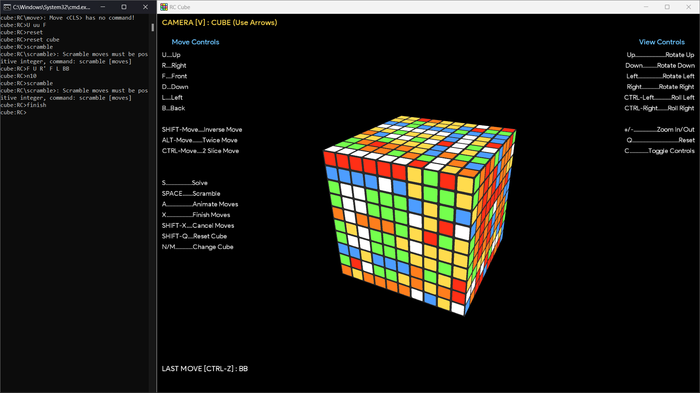
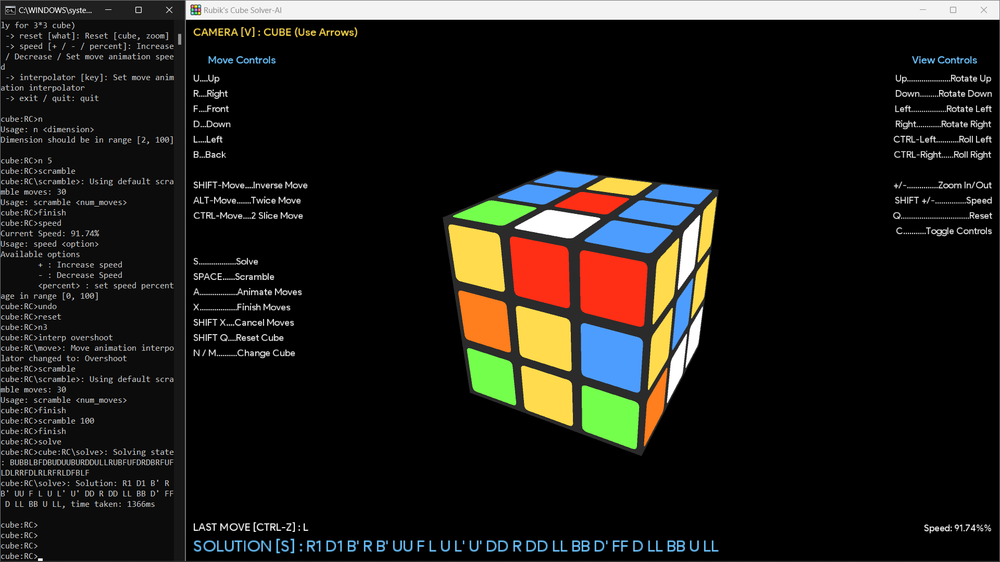
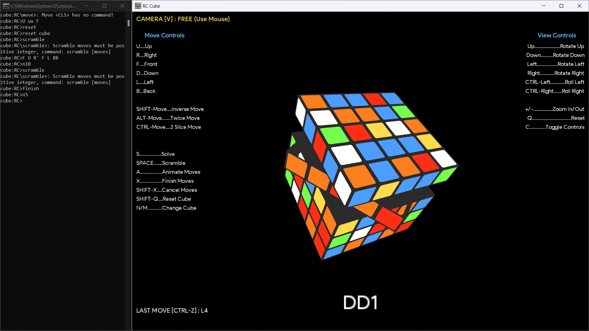

# Rubik's Cube Solver-AI  

#### This is a 3D N*N Rubik's cube simulation and AI solver program. It supports any N-dimension cube, with UI and Command-Line controls
#### [View Demo on YouTube](https://www.youtube.com/watch?v=Ivm3o5bG-fI)
###### See also
[Fourier Series Simulation](https://github.com/ChauhanRohan-RC/Fourier-Series.git)  
[RSA Encryptor](https://github.com/ChauhanRohan-RC/RSA-Encryptor.git)  
[Online Multiplayer Ping-Pong AI](https://github.com/ChauhanRohan-RC/Ping-Pong-AI.git)

## Features
* _Deep Neural Network_ (DNN) trained using _Stochastic Gradient Descent_ over millions of possible states. 
* Kociemba [2-Phase Algorithm](http://kociemba.org/math/imptwophase.htm) is used to generate on-the-fly data for training and testing
* Animated moves, Free and Clamped Camera modes in a 3D space, idle state levitation, stickers with lighting effects. 
* Immersive Ui and Command Line control

## Usage
* Install [Java](https://www.oracle.com/in/java/technologies/downloads/) on your computer and add it to the path 
* Clone this repository  
  `git clone https://github.com/ChauhanRohan-RC/Cube.git`
* Navigate to `out\artifacts\cube_jar` and run `launch.bat`.  
Optionally, open the terminal and run `java -jar cube.jar`

## Moves (Clockwise)
* U: Up 
* R: Right 
* F: Front 
* D: Down 
* L: Left 
* B: Back 

####
* Moves in the command line are case-insensitive
* Add prime ' for an anticlockwise move
  * `R` (clockwise) -> `R'` (anti-clockwise)
* Type the move character twice for a half turn (180 deg)
  * `R` (single turn) -> `RR` (double turn)
* To turn a middle slice, add it's index in range [0, n-1] from the side of move
  * `R1` :turns the 2nd slice from right face
  * `U'3` : turns the 4th slice from UP anticlockwise
* To turn multiple slices in a single move, type their indices in brackets separated by comma. 
  * `R[0,2]` : turns 1st and 3rd slices from the right face in clockwise direction
  * `F'[1,5,9]` : turns 2nd, 6th and 10th slices from the front face in anti-clockwise direction (for a cube with N > 9)
  * `UU[3,12]` : turns 4th and 13th slices from the top face 180° (for a cube with N > 12)

## Commands
* Enter a move sequence, with each move separated by space. For example
  * `f r u  r' u' f'`
  * `U FF b' L r f' bb F`
  * `U R' F[2,5] LL D B'[3,5]` 
* `n <dimension>` : sets the cube dimension 
* `scramble <moves>`: scramble the cube with given number of moves 
* `solve` : Solve the current state / Apply the generated solution
* `reset cube` : Reset the cube to starting cube
* `reset zoom` : Reset Ui zoom
* `undo` : undo the last move 
* `finish`: finish moves without animating
* `finish c`: cancel pending or currently animating moves
* `exit/quit`: quit

## Connect on
[Twitter](https://twitter.com/0rc_studio)  
[Youtube](https://www.youtube.com/channel/UCmyvutGWtyBRva_jrZfyORA)  
[Google Play Store](https://play.google.com/store/apps/dev?id=7315303590538030232)  
E-mail: com.production.rc@gmail.com