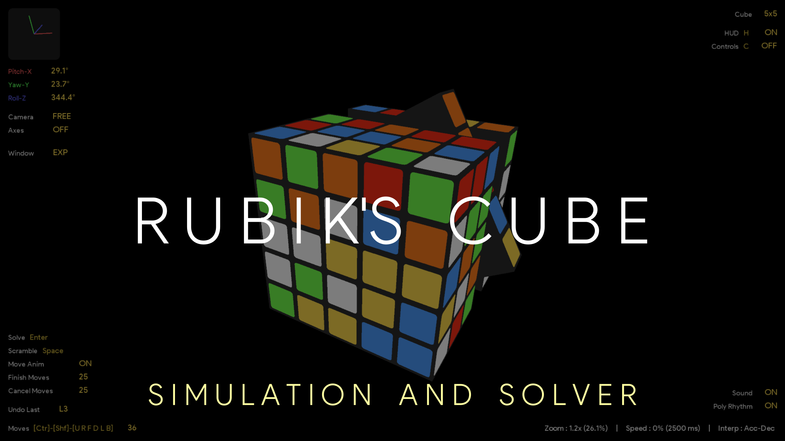
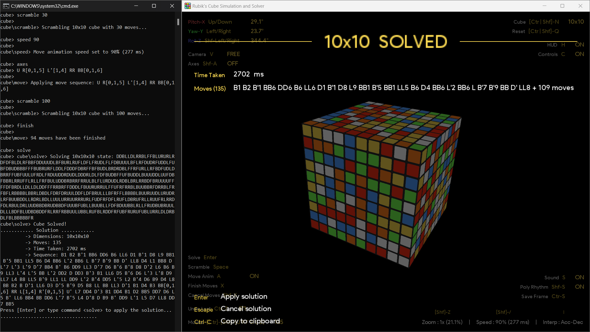

# Rubik's Cube Simulation and Solver-AI

#### This is a 3D generic NxNxN Rubik's cube simulation and solver program. It supports any N-dimension cube, with graphical and Command-Line interface controls

#### [View Demo on YouTube](https://www.youtube.com/playlist?list=PL_oeaRvQxDbRrbn8knIZO6Z0huWYp4iHq)

###### See also

[Fourier Series Simulation](https://github.com/ChauhanRohan-RC/Fourier-Series.git)  
[RSA Encryptor](https://github.com/ChauhanRohan-RC/RSA-Encryptor.git)  
[Online Multiplayer Ping-Pong AI](https://github.com/ChauhanRohan-RC/Ping-Pong-AI.git)

## Usage

* Install [Java](https://www.oracle.com/in/java/technologies/downloads/) on your computer and add it to the path
* Clone this repository  
  `git clone https://github.com/ChauhanRohan-RC/Cube.git`

####

* Navigate to [out/artifacts/cube_jar](out/artifacts/cube_jar) folder
* `Optional`: Checkout the configuration file [configuration.ini](out/artifacts/cube_jar/configuration.ini)
* Run [launch.bat](out/artifacts/cube_jar/launch.bat).
* Optionally, open up the terminal and run `java -jar cube.jar`

## Algorithm

* Uses a 2-phase generic A* algorithm with manhattan cost function, based
  on the extension of basic [Kociemba Algorithm](http://kociemba.org/math/imptwophase.htm)
* Solves any NxN dimension cube through an iterative stochastic gradient descent of heuristic cost function
* Especially optimized to solve a **_3x3 cube under 20 moves in less than 1 second_**
* The preprocessing phase includes
    * Error checks for facelets, edges, corners, edge flips, corner twists and parity
    * Normalization of odd dimensional cubes against flipping transformations that changes center cubies orientation
    * Conversion of cubie-facelet representation to normalized face representation with standard facelet codes
* The search phase includes
    * Align corner pieces to match parity
    * Solve corners
    * Solve edges
    * Align corners and edges together
    * Finally, solve faces to match facelets

## Moves Notation

* `U` : Up
* `R` : Right
* `F` : Front
* `D` : Down
* `L` : Left
* `B` : Back

####

* Moves in the command line are _**Case-Insensitive**_
* Add prime `'` for an anticlockwise move
  * `R` (clockwise) -> `R'` (anti-clockwise)
* Type the move character twice for a half turn (180 deg)
  * `R` (single turn) -> `RR` (double turn)
* To turn a middle slice, add it's index in range `[0, n-1]` from the side of move
  * `R1` :turns the 2nd slice from right face
  * `U'3` : turns the 4th slice from UP anticlockwise
* To turn multiple slices in a single move, type their indices in brackets separated by comma.
  * `R[0,2]` : turns 1st and 3rd slices from the right face in clockwise direction
  * `F'[1,5,9]` : turns 2nd, 6th and 10th slices from the front face in anti-clockwise direction (for a cube with N >
    9)
  * `UU[3,12]` : turns 4th and 13th slices from the top face 180° (for a cube with N > 12)

## Features
* Create and interact with any NxNxN cube in 3D space
* Both graphical and Command Line interface controls

### Move Features
* Inner layer moves
* Clockwise, anticlockwise and 180° rotation moves
* Reverse and undo applied moves
* Apply Multiple moves at once, including outer and inner layer moves
* Scramble the cube with given number of random moves

### Graphical Features
* stickers with 3D lighting effects
* Free and Locked Camera modes in a 3D space
* Translate, Scale, Yaw, Pitch and Roll the cube with animations
* idle state levitation: cube will "**_breath_**" when idle

### Animation Features
* Finish or Cancel pending animations
* Control animation speed (Set Percentage/Duration from console, or control from UI)
* Set move animation interpolator. Available Interpolators are

| Key        | Interpolator                       | Description                                                                                                         |
|------------|------------------------------------|---------------------------------------------------------------------------------------------------------------------|
| default    | Default                            | Uses Default Interpolator                                                                                           |
| linear     | Linear Interpolator                | Interpolates linearly between start and end states                                                                  |
| bounce     | Bounce Interpolator                | Change bounces at the end                                                                                           |
| acc        | Accelerate Interpolator            | Rate of change starts out slowly and then accelerates towards the end                                               |
| dec        | Decelerate Interpolator            | Rate of change starts out quickly and then decelerates as the end approaches                                        |
| acd        | Accelerate Decelerate Interpolator | Rate of change starts and ends slowly but accelerates through the middle                                            |
| anticipate | Anticipate Interpolator            | Change starts backward then flings forward                                                                          |
| overshoot  | Overshoot Interpolator             | Change starts backward then flings forward and overshoots the target value and finally goes back to the final value |

## UI Controls

### Cube Controls
* `[Ctrl | Shift]-N` : Change cube Dimension  (Discrete)
  * `N` : Increase Size
  * `Shift-N` : Decrease Size
  * `Ctrl-[Shift]-N` : Force change size

* `[Ctrl | Shift]-Q` : Resets the Cube  (Discrete)
  * `Q` : reset cube state
  * `Shift-Q` : reset camera
  * `Ctrl-Q` : reset simulation
  * `Ctrl-Shift-Q` : reset everything

* `Shift-A` : Show/Hide cube axes  (Discrete)

### Move Controls

* `[Ctrl]-[Shift]-[U R F D L B]` : Cube moves  (Discrete)
  * `[U | R | F | D | L | B]` keys : clockwise move
  * with `Shift` : anticlockwise move
  * with `Ctrl` : 2-slice move
  * with `Ctrl-Shift` : 180° move

* `Space` : Scramble with default number of moves (default: 30)  (Discrete)
* `Enter` : Solve or apply solution  (Discrete)

* `Ctrl-Z` : Undo last move  (Discrete)
* `X` : Finish all running and pending moves  (Discrete)
* `Shift-X` : Cancel all running and pending moves  (Discrete)

* `Escape` : Cancel pending moves and stop solving, or exit  (Discrete)

### Animation Controls
* `A` : Toggle Move Animations  (Discrete)

* `[Shift]-/` : ove animation speed (in percent) and animation time (in ms)  (Continuous)
  * `/` : Increase Speed
  * `Shift-/` : Decrease Speed

* `I` : Change Move Animation Interpolator  (Discrete)

### Graphics and Sound Controls
* `Ctrl-S` : Save Current graphics frame in a png file  (Discrete)
* `W` : Sets the fullscreen mode to Expanded or Windowed  (Discrete)

* `H` : Show/Hide HUD  (Discrete)
* `C` : Show/Hide Control Key Bindings  (Discrete)

* `S` : Toggle Sounds  (Discrete)
* `Shift-S` : Toggle Poly Rhythm (play multiple notes at once)  (Discrete)

### Camera Controls
* `V` : Toggle camera mode between `FREE` and `LOCKED`  (Discrete)

* `[Shift]-Z` : Cube zoom, in both multiples and percentage  (Discrete)
  * `Z` : Zoom In
  * `Shift-Z` : Zoom Out
  

* `UP` and `DOWN` arrows : Controls the Camera PITCH (rotation about X-Axis)  (Discrete)

* `LEFT` and `RIGHT` arrows : Controls the Camera YAW (rotation about Y-Axis)  (Discrete)

* `Shift-[LEFT | RIGHT]` arrows : Controls the Camera ROLL (rotation about Z-Axis  (Discrete)

## Commands

* `help [-moves | -controls | -commands | -all]` : Print usage information
  * Scopes
    * `-moves` : print moves notation and usage
    * `-controls` : print controls usage
    * `-commands` : print commands usage
    * `-all` : print entire usage information

### Cube Commands
* `size <size>` : Sets the cube size
  * Alias: `dim`, `cube`

* `reset [-f] [-state | -env | -cam | -win | -all]` : Reset given scope(s)
  * Scopes
    * `-state` : reset cube state
    * `-env` : reset simulation environment
    * `-cam` : reset camera (pitch, yaw and roll)
    * `-win` : reset window size and position
    * `-all` : reset everything  `(Default)`
  * Options
    * `-f` : force reset without animations

* `axes` : toggle cube axes
  * Alias: `toggle axes`

### Move Commands
* `<move_seq>` : Directly enter moves separated by space to apply
  * Examples
    * `U R' FF B2 L'[0,1]`
    * For 5x5 cube: `R' FF U[0,1,3] B'[1,2] L`

* `solve` : Solve the current state or Apply solution
* `scramble <num_moves>` : Scramble with the given number of moves

* `undo` : Undo the last move
* `finish` : finish animating and pending moves
* `cancel` : cancel solver and all pending moves
  * Alias: `stop`

### Animation Commands
* `anim` : toggle move animations
  * Alias: `toggle anim`, `animations`, `toggle animations`

* `speed [-p | -d] <value>` : Set move animation speed or duration
  * Modes
    * `-p` : animation speed, in percentage  `(Default)`
    * `-d` : animation duration, in milliseconds

* `interpolator <next | key>` : Sets the move animation interpolator (Use keys from the interpolator table)
  * Alias: `intp`, `interp`
  * Wildcards
    * `next` : cycle to next interpolator

### Window Commands
* `save` : Save current frame to a png file
  * Alias: `snap`, `snapshot`, `saveframe`

* `win [-size | -pos] <x> <y>` : Sets the window size or location on screen
  * Options
    * `-size` : set window size.
    * `-pos` : set window location on screen
  * Wildcards
    * `w` : set to initial windowed size. To be used with `-size` option
    * `c` : center window on screen. To be used with `-pos` option

* `expand` : Expand / Collapse Fullscreen window
  * Alias: `toggle expand`, `collapse`, `toggle collapse`

### Camera Commands
* `cam [-free | -locked | -toggle]` : set or toggle camera modes
  * Modes
    * `-free` : free camera mode, mouse controlled
    * `-locked` : locked camera, keyboard controlled
    * `-toggle` : toggle camera mode between `FREE` and `LOCKED`  `(Default)`
  * Options
    * `-f` : force without animations

* `zoom [-x | -p] <value>` : sets the cube zoom
  * Alias: `scale`
  * Modes
    * `-x` : Multiples or times  `(Default)`
    * `-p` : percentage, in range [0, 100]

* `pitch [-by | -f] <+ | - | value_in_deg>` : Sets the camera pitch (rotation about X-axis)
  * Alias: `rx`, `rotx`, `rotationx`
  * Wildcards: `+` or `up`, `-` or `down`
  * Options
    * `-by` : change current pitch by the given value
    * `-f` : force without animations

* `yaw [-by | -f] <+ | - | value_in_deg>` : Sets the camera yaw (rotation about Y-axis)
  * Alias: `ry`, `roty`, `rotationy`
  * Wildcards: `+` or `left`, `-` or `right`
  * Options
    * `-by` : change current yaw by the given value
    * `-f` : force without animations

* `roll [-by | -f] <+ | - | value_in_deg>` : Sets the camera roll (rotation about Z-axis)
  * Alias: `rz`, `rotz`, `rotationz`
  * Wildcards: `+` or `left`, `-` or `right`
  * Options
    * `-by` : change current roll by the given value
    * `-f` : force without animations

### Graphics and Sound Commands
* `hud` : Show / Hide HUD overlay
  * Alias: `toggle hud`
* `keys` : Show / Hide control key bindings
  * Alias: `toggle keys`, `controls`, `toggle controls`

* `sound` : Toggle sounds
* `poly-rhythm` : Toggle Poly Rhythm mode. If enabled, it allows playing multiple notes at once

* `exit` or `quit`: quit program

## Connect on
[GitHub](https://github.com/ChauhanRohan-RC)  
[Twitter](https://twitter.com/0rc_studio)  
[Youtube](https://www.youtube.com/channel/UCmyvutGWtyBRva_jrZfyORA)  
[Google Play Store](https://play.google.com/store/apps/dev?id=7315303590538030232)  
E-mail: com.production.rc@gmail.com

